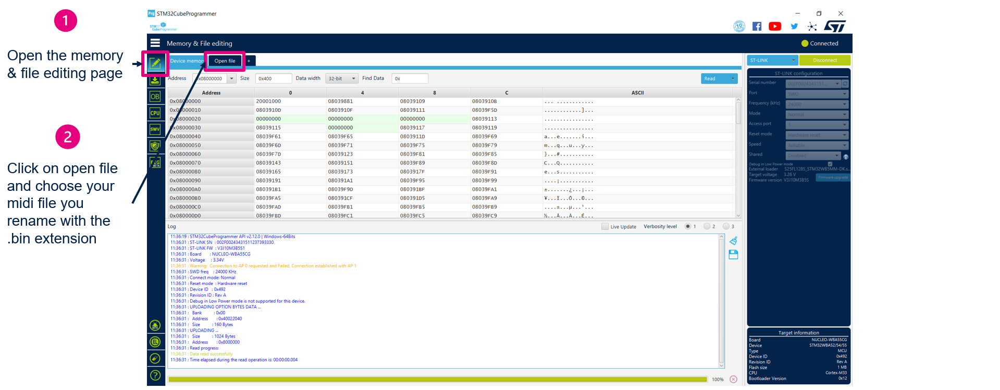

# MIDI over BLE demo application

MIDI over BLE was firstly developed by Apple and is now part of the MIDI specification. 

## Application description

This application acts as a MIDI controller. The controller can send events to a MIDI over BLE Compatible device (this application was tested with : Apple Garage Band on iOS, SynprezFM on Android). Note that this is a proof of concept and demonstrates a simple working implementation of MIDI over BLE but is not a fully MIDI Specification compliant library.   

[Use a BLE MIDI device with GarageBand](https://support.apple.com/guide/garageband-ipad/a-bluetooth-midi-device-touch-instruments-chse356a0321/ipados#:~:text=Tap%20the%20Settings%20button%20in,tap%20the%20Connect%20switch%20off.)

### Features 

* Air piano : 

  Put your hand over the ToF sensor of the board to play a note (make sure you stay with your hand over the sensor until the note is sent). The note sent will depend on the distance between the sensor and your hand (maximum 150cm). To play another note you need to remove your hand from the sensor field of view and put it again.  

  

* Midi file player :

  - Push on the B2 button to start playing the midi file loaded in the external flash. (File loading procedure explained below)

  

  - Push B2 again to pause or B1 to go to the start of the song

### Midi file player and parser limitations

The application implements a basic midi file parser. There are the limitations :
  - Track name will only be read if it is present in the first track. 
  - At most , the first 2 tracks will be parsed. If the two tracks contain notes events, they will be played one after the other and not in parallel. (Midi files taken for test were usually containing a first track with track name and other data and the second track was use for notes events) 
  - Only the first tempo will be taken in account.
  - If the file has more notes events than the MAX_EVENTS value (default : 2000), they will be ignored.

### Example resources

The application has been tested with the following midi files : 
 - [La Cucaracha](https://www.8notes.com/scores/509.asp)
 - [Hungarian Dance No.1](https://www.8notes.com/scores/20983.asp) (No track name will be displayed)
 - [The Trout](https://www.8notes.com/scores/427.asp)
 - [Aragon Op.47 part 6](https://bitmidi.com/19al476-mid) (No track name will be displayed)
 - [Au clair de la lune](https://www.8notes.com/scores/22783.asp)
 - [The Entertainer](https://www.8notes.com/scores/531.asp)
 - [I Dreamed I Was Playing The Piano](https://www.8notes.com/scores/22850.asp)

## User's Guide

This application was developed with STM32CubeWB package v1.16.0 and CubeMX 6.8.1.

### Requirements

  - [STM32 Cube Programmer](https://www.st.com/en/development-tools/stm32cubeprog.html)
  - [STM32 Cube IDE](https://www.st.com/en/development-tools/stm32cubeide.html) or IAR 9.20.1
  - [STM32WB5MM-DK](https://www.st.com/en/evaluation-tools/stm32wb5mm-dk.html)

### Setup

1. Flash the BLE wireless stack **full** on the STM32WB5MM-DK board.

2. Build the BLE_Midi project and flash the board with it.

3. Load the midi file in the external flash following these instructions :
  
    A) Copy and rename your midi file with the .bin extension. This is because Cube Programmer will filter on file extensions and won’t let you flash a .mid file.

    

    B) Open STM32CubeProgrammer and follow the instructions below to load your file in the external flash.

    

    

    

    

    

 4. **Unplug and replug your board** this is needed to apply the changes in the external flash.

 5. You can now connect with your smartphone (or another MIDI over BLE compliant receiver) to your board and use it.

## Code structure 

For now, the MIDI over BLE interface in custom_app is limited to the *Midi_Send_Note* function but can be easily extended on the same model for other events like pitch bend, after touch, etc...

## Midi player flowchart

## Wiki pages

If you want more details about BLE and STM32WB you can check the [wiki pages](https://wiki.st.com/stm32mcu/wiki/Category:Bluetooth_Low_Energy).

## Troubleshooting

**Caution** : Issues and the pull-requests are **not supported** to submit problems or suggestions related to the software delivered in this repository. The STM32WB-BLE-MIDI example is being delivered as-is, and not necessarily supported by ST.

**For any other question** related to the product, the hardware performance or characteristics, the tools, the environment, you can submit it to the **ST Community** on the STM32 MCUs related [page](https://community.st.com/s/topic/0TO0X000000BSqSWAW/stm32-mcus).

